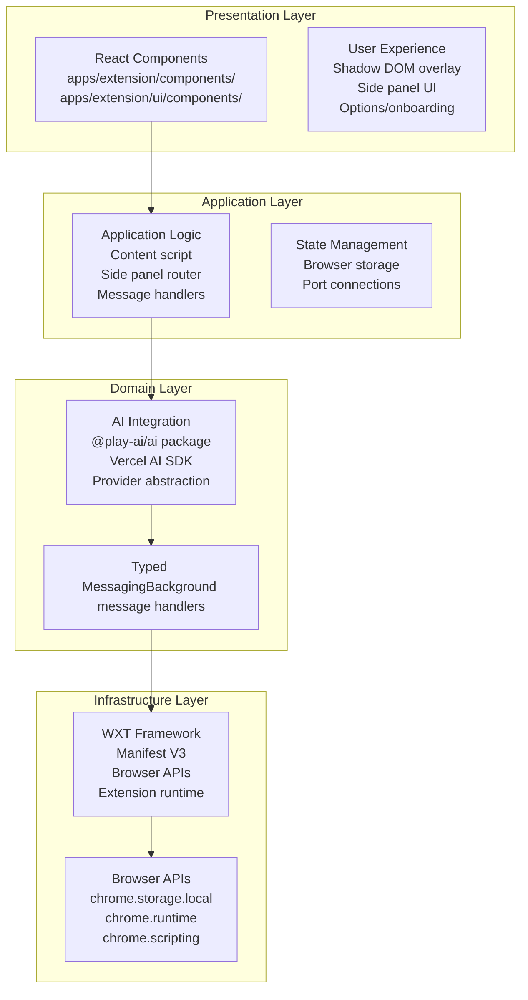
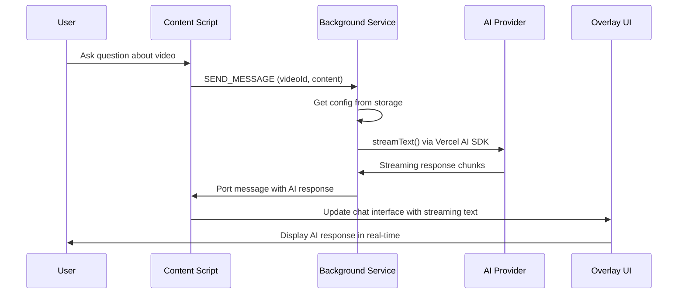
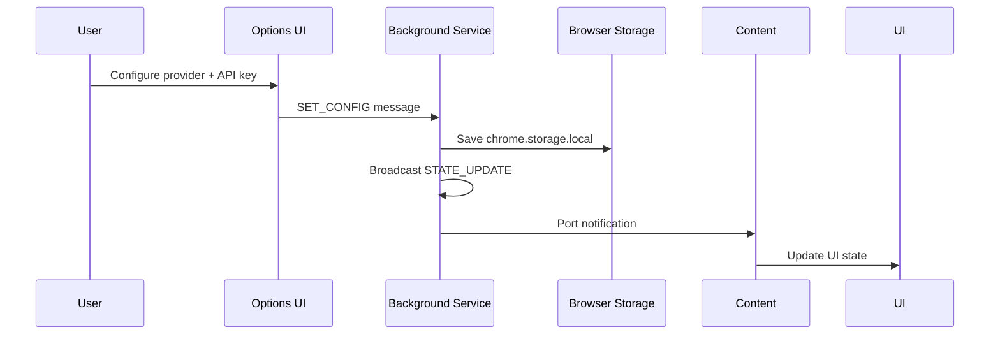
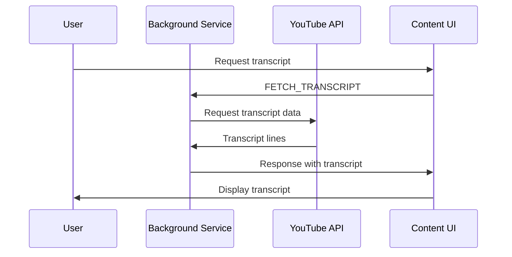

# Architecture

Play AI is a browser extension that enables AI-powered chat about YouTube videos using Anthropic Claude or OpenAI models.

## Overview

**What play-ai is:** Browser extension for AI-powered video analysis and conversation

**Tech stack:** WXT, React 19, TypeScript, Vercel AI SDK, shadcn/ui, Tailwind v4

**Browser targets:** Chrome (side_panel), Firefox (sidebar_action), Edge (side_panel)

## Architecture Layers

The extension follows a 4-layer architecture with clear separation of concerns:



### Layer Responsibilities

**Presentation Layer**
- React components for user interface
- Shadow DOM overlay on YouTube pages
- Side panel UI with TanStack Router navigation
- Onboarding and settings forms
- AI element components for rich display

**Application Layer**
- Content script injection and lifecycle management
- Side panel routing and navigation
- Background service worker message handling
- State synchronization across contexts
- UI orchestration and coordination

**Domain Layer**
- AI provider abstraction (OpenAI, Anthropic, custom endpoints)
- Message type definitions and validation
- Typed messaging system
- Video platform adapters (YouTube, Invidious fallback)
- Storage utilities and helpers

**Infrastructure Layer**
- WXT framework and manifest generation
- Browser extension APIs and permissions
- Cross-browser compatibility layer
- Build tooling and development server

## Data Flow

### AI Chat Flow



### Settings Configuration Flow



### Transcript Retrieval Flow



## Communication Patterns

### Extension Messaging

The extension uses typed messaging between contexts:

- **Content Script → Background:** SEND_MESSAGE, SET_CONFIG, TEST_CONNECTION, GET_STATE
- **Background → Content:** STATE_UPDATE, AI response streaming
- **Side Panel ↔ Background:** Port-based messaging for real-time updates
- **All contexts:** Broadcast pattern for state changes

```typescript
// Message types (from ~/lib/messaging.ts)
type MessageType =
  | { type: "GET_STATE" }
  | { type: "SET_CONFIG"; payload: AppConfig }
  | { type: "SEND_MESSAGE"; payload: { videoId: string; content: string } }
  | { type: "CLEAR_CHAT"; payload: { videoId: string } }
  | { type: "STATE_UPDATE"; patch: Partial<ExtensionState> }
  | { type: "TEST_CONNECTION"; payload: { provider: "anthropic" | "openai"; baseUrl?: string; apiKey: string } }
  | { type: "FETCH_TRANSCRIPT" }
```

### Storage-Based State

**Single source of truth:** `chrome.storage.local`

**Broadcast pattern:**
1. Background service worker reads/writes config and chat history
2. On storage change, background notifies all connected tabs and ports
3. Content script + side panel receive updates via `chrome.runtime.onMessage`

### Content Script ↔ Page DOM

The content script injects React components into YouTube's sidebar using Shadow DOM:

```typescript
// Anchor detection (~/entrypoints/content/index.ts)
function findAnchor(): HTMLElement | null {
  return (
    document.querySelector("#secondary") ||
    document.querySelector('[aria-label="Secondary"]') ||
    document.querySelector("ytd-watch-flexy #related")
  );
}
```

## Extension Points

### Adding New AI Providers

1. **Extend provider types** in `@play-ai/ai/core/types`
2. **Add provider factory** in `@play-ai/ai/src/providers.ts`
3. **Update UI model selector** in `components/ai-elements/model-selector.tsx`
4. **Add tests** for the new provider

> **Note on model defaults:** This extension intentionally does NOT hardcode model lists (e.g. `ANTHROPIC_MODELS`, `OPENAI_MODELS`). Models get released and deprecated frequently, making hardcoded lists a maintenance burden. Instead, models are fetched at runtime via `fetchModels()` using the AI SDK. For build-time defaults, consider fetching from [models.dev](https://models.dev) during the build step — this provides an up-to-date catalog of available models across providers without requiring manual updates.

### Adding New Video Platforms

1. **Create platform adapter** in `@play-ai/ai/core/adapters`
2. **Implement `getVideoId()` method** for platform-specific URL parsing
3. **Update `detectPlatform()`** function
4. **Test platform detection** with sample URLs

### Adding New UI Components

1. **Check existing components** in `components/ui/` (shadcn) and `components/ai-elements/`
2. **Custom components** go in `ui/components/` with kebab-case naming
3. **Use `cn()` utility** for class composition
4. **Follow design system rules** from `docs/dev-guidelines.md`

## Directory Structure

```
apps/extension/
├── entrypoints/                 # WXT entry points
│   ├── background.ts            # MV3 service worker (AI proxy + state hub)
│   ├── content/                 # YouTube content script
│   │   ├── index.ts            # Content script entry point
│   │   ├── App.tsx             # Shadow DOM React app
│   │   └── style.css           # Overlay styles
│   ├── sidepanel/               # Side panel UI
│   │   ├── main.tsx           # React + TanStack Router entry
│   │   ├── routes.tsx         # Route definitions
│   │   └── pages/             # Route components
│   └── options/                # Onboarding/settings
│       ├── main.tsx           # React + TanStack Router entry
│       ├── routes.tsx         # Route definitions
│       └── pages/             # Route components
├── background/messages/         # Message handlers
│   ├── index.ts               # Message routing
│   ├── getState.ts            # Get extension state
│   ├── setConfig.ts           # Update configuration
│   ├── sendMessage.ts         # Process AI chat
│   ├── clearChat.ts           # Clear conversation
│   ├── testConnection.ts      # Test API connection
│   └── getTranscript.ts       # Fetch transcript
├── lib/                        # Core utilities
│   ├── messaging.ts           # Typed messaging system
│   └── storage.ts             # Browser storage helpers
├── components/                 # UI components
│   ├── ui/                    # shadcn components (READ-ONLY)
│   ├── ai-elements/          # AI-specific components (READ-ONLY)
│   └── chat/                  # Custom chat components
└── ui/components/             # Custom UI components
    ├── chat-container.tsx     # Main chat interface
    ├── chat-message.tsx       # Individual message display
    ├── provider-setup-form.tsx # Setup form
    └── video-info.tsx         # Video metadata display
```

## Key Design Decisions

### WXT Framework
- Uses WXT for cross-browser compatibility (Manifest V3)
- Auto-handles manifest differences between Chrome/Firefox/Edge
- Provides TypeScript-first development experience

### Shadow DOM Isolation
- Content script uses Shadow DOM for UI isolation
- Prevents CSS conflicts with YouTube's styles
- Maintains component encapsulation

### Background Service Worker Architecture
- Single background worker handles all AI requests
- Centralized state management via browser storage
- Port-based messaging for real-time updates

### Streaming AI Responses
- Uses Vercel AI SDK `streamText()` for real-time responses
- Chunked messages sent via port connections
- UI updates progressively as responses stream

### TanStack Router for Navigation
- Hash-based routing for sidepanel and options pages
- No full page reloads required
- Client-side navigation maintains state

## Cross-Browser Considerations

### Chrome
- Uses `side_panel` API for dedicated panel
- Full Manifest V3 support
- Advanced browser APIs available

### Firefox
- Uses `sidebar_action` as fallback
- Some Chrome APIs require polyfills
- WXT auto-manifest differences

### Edge
- Same Chrome APIs available
- Uses `side_panel` API
- WXT ensures compatibility

## Performance Optimizations

- **Lazy loading:** React components loaded on-demand
- **Shadow DOM:** Prevents layout recalculation
- **Port messaging:** Efficient real-time communication
- **Storage caching:** Minimizes read operations
- **Debounced updates:** Prevents excessive UI redraws